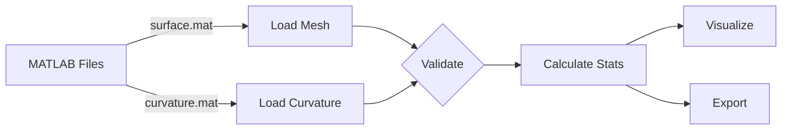

# MeshAnalyzer

> Quantitative morphology analysis for 3D cell surface reconstructions

MeshAnalyzer bridges MATLAB-based mesh generation (u-shape3D) with Python's scientific computing ecosystem, providing a streamlined workflow for analyzing cellular morphology from fluorescence microscopy.

---

## What is this?

When studying immune cells under the microscope, we often need to quantify their shape—how rough is the membrane? Are there blebs forming? How does the cell change over time? MeshAnalyzer takes 3D surface meshes from u-shape3D and calculates everything you need: volume, curvature distributions, surface area, and temporal dynamics.

Think of it as your morphology calculator. You feed it meshes, it gives you numbers and visualizations.

---

## Installation

```bash
cd /path/to/Scripts
pip install -e .
```

The `-e` flag means editable mode—you can modify the source without reinstalling. Useful when you're still figuring things out.

**Dependencies** (installed automatically):
- numpy, scipy, matplotlib (the usual suspects)
- vedo (mesh handling)
- mat73, h5py (MATLAB file compatibility)

Quick sanity check:
```bash
python -c "from MeshAnalyzer import MeshAnalyzer; print('Ready to go')"
```

---

## Quick Start

Here's the basic workflow:

```python
from MeshAnalyzer import MeshAnalyzer

# Point it to your data
analyzer = MeshAnalyzer(
    surface_path='surface_1_1.mat',
    curvature_path='meanCurvature_1_1.mat',
    pixel_size_xy=0.103,  # Your microscope settings
    pixel_size_z=0.217
)

# Load and analyze
analyzer.load_data()
results = analyzer.calculate_statistics()

# See what you got
print(results.summary())
```

You'll get something like:
```
=== Analysis Summary ===
Vertices: 37,680
Faces: 75,360
Volume: 262.32 μm³
Surface Area: 1,847.56 μm²

Curvature: 0.0123 ± 0.0456
Range: [-0.2341, 0.3124]
```

---

## How It Works



The pipeline is straightforward: load your mesh, validate it's properly formed, calculate statistics, and visualize or export results. Everything is cached, so recalculating doesn't repeat expensive operations.

---

## Understanding Curvature

Curvature tells you how bent the membrane is at each point. Two main types:

**Mean Curvature** (H = (κ₁ + κ₂)/2)
- Positive: convex bumps (blebs, filopodia)
- Negative: concave dents (invaginations)
- Zero: flat or saddle-shaped

**Gaussian Curvature** (K = κ₁ × κ₂)
- Positive: peaks or pits (elliptic points)
- Negative: saddle shapes (hyperbolic points)
- Zero: cylindrical surfaces (parabolic points)

The sign convention matters. In our setup, a bleb has positive mean curvature. A phagocytic cup has negative mean curvature. If your results seem backwards, check the mesh orientation.

---

## Core Modules

### Analyzer

The main interface. Handles mesh loading, validation, and statistics calculation.

```python
from MeshAnalyzer import MeshAnalyzer

analyzer = MeshAnalyzer('surface.mat', 'curvature.mat')
analyzer.load_data()
results = analyzer.calculate_statistics()

# Access individual metrics
print(f"Volume: {results.mesh_stats.volume_um3:.2f} μm³")
print(f"Surface area: {results.mesh_stats.surface_area_um2:.2f} μm²")
print(f"Mean curvature: {results.curvature_stats.mean:.4f}")
```

**Automatic quality checks:**
- Mesh orientation correction (negative volumes get flipped)
- Topology validation (checks if surface is closed)
- Triangle quality metrics (aspect ratios, uniformity)

### Visualization

Two main plotting functions for exploring your data:

#### Curvature Distribution

```python
from MeshAnalyzer import plot_curvature_distribution

fig = plot_curvature_distribution(
    analyzer.curvature,
    save_path='curvature_dist.pdf'
)
```

<div align="center">
<table>
<tr>
<td width="50%">
<b>Linear Scale</b><br>
Shows the full distribution with zero reference line
</td>
<td width="50%">
<b>Log Scale</b><br>
Reveals tail behavior and rare events
</td>
</tr>
</table>
</div>

#### Spatial Curvature Map

```python
from MeshAnalyzer import basic_spatial_plot

fig, ax = basic_spatial_plot(
    analyzer.mesh,
    analyzer.curvature,
    title="Membrane Curvature Distribution"
)
```

<div align="center">
<table>
<tr>
<td>
<i>Red regions: positive curvature (blebs, protrusions)</i><br>
<i>Blue regions: negative curvature (invaginations)</i><br>
<i>White: near-zero curvature (flat membrane)</i>
</td>
</tr>
</table>
</div>

The colormap is symmetric around zero with robust scaling (95th percentile) to avoid outlier dominance. Statistics overlay in the corner shows mean ± std.

### Time-Lapse Analysis

When you're tracking cells over time, `TimeSeriesManager` handles the complexity:

```python
from MeshAnalyzer import TimeSeriesManager

manager = TimeSeriesManager(
    data_dir='/path/to/timelapse/data',
    pixel_size_xy=0.103,
    pixel_size_z=0.217,
    cache_mode='lazy'  # Memory-efficient
)

# Discover all frames
n_frames = manager.discover_frames()
print(f"Found {n_frames} timepoints")

# Validate temporal consistency
results = manager.validate_frames()

# Global normalization (critical for comparisons)
normalized = manager.get_normalized_curvature(
    method='symmetric',
    percentile_range=(5, 95)
)
```

<div align="center">

```
┌─────────────────────────────────────┐
│     TimeSeriesManager               │
│                                     │
│  Frame 1  Frame 2  ...  Frame 50   │
│  [cache]  [cache]       [on-disk]  │
│                                     │
│  LRU Cache: 10 frames in memory    │
│  Global normalization across all   │
└─────────────────────────────────────┘
```

</div>

**Three cache modes:**
- `'none'`: Minimal memory, reload each access
- `'lazy'`: LRU cache, balanced approach (default)
- `'all'`: Preload everything, fastest but RAM-heavy

For 50 frames of neutrophil data (~80MB each), lazy caching uses ~800MB vs ~4GB for preloading. Choose based on your workflow and available memory.

---

## Practical Examples

### Basic Analysis Workflow

```python
from MeshAnalyzer import MeshAnalyzer

analyzer = MeshAnalyzer(
    'surface_1_1.mat',
    'meanCurvature_1_1.mat',
    pixel_size_xy=0.1661,
    pixel_size_z=0.5
)

analyzer.load_data()
results = analyzer.calculate_statistics()

# Quality check
if not results.mesh_stats.is_watertight:
    print("Warning: Mesh has holes—volume may be unreliable")

warnings = results.quality_metrics.get_warnings()
if warnings:
    for w in warnings:
        print(f"  {w}")
```

### Detecting High Curvature Regions

```python
from MeshAnalyzer.utils import find_high_curvature_regions

# Find blebs and protrusions
high_curv_mask = find_high_curvature_regions(
    analyzer.curvature,
    threshold=2.5
)

n_blebs = high_curv_mask.sum()
print(f"Detected {n_blebs} high-curvature faces")
```

### Batch Processing

```python
from pathlib import Path
import pandas as pd

results_list = []
data_dir = Path('/path/to/cells')

for surface_file in data_dir.glob('**/surface_*.mat'):
    curv_file = surface_file.parent / surface_file.name.replace(
        'surface', 'meanCurvature'
    )

    if curv_file.exists():
        analyzer = MeshAnalyzer(
            str(surface_file),
            str(curv_file),
            pixel_size_xy=0.1661,
            pixel_size_z=0.5
        )
        analyzer.load_data()
        results = analyzer.calculate_statistics()

        results_list.append({
            'cell_id': surface_file.stem,
            'volume_um3': results.mesh_stats.volume_um3,
            'surface_area_um2': results.mesh_stats.surface_area_um2,
            'mean_curvature': results.curvature_stats.mean,
        })

df = pd.DataFrame(results_list)
df.to_csv('batch_results.csv', index=False)
```

### Time-Lapse Animation

```python
from MeshAnalyzer import TimeSeriesManager
import matplotlib.pyplot as plt
from matplotlib import animation

manager = TimeSeriesManager(
    data_dir='/path/to/timelapse',
    pixel_size_xy=0.103,
    pixel_size_z=0.217
)

manager.discover_frames()
normalized = manager.get_normalized_curvature(method='symmetric')

# Setup figure
fig = plt.figure(figsize=(10, 10), facecolor='black')
ax = fig.add_subplot(111, facecolor='black')
ax.axis('off')

# Initialize with first frame
first_data = manager[1]
scatter = ax.scatter(
    first_data.face_centers[:, 0],
    first_data.face_centers[:, 1],
    c=normalized[1],
    s=2.0,
    cmap='RdBu',
    vmin=-1,
    vmax=1
)

def update(frame_idx):
    time_idx = list(manager.keys())[frame_idx]
    data = manager[time_idx]
    scatter.set_offsets(data.face_centers[:, :2])
    scatter.set_array(normalized[time_idx])
    return [scatter]

anim = animation.FuncAnimation(
    fig, update,
    frames=len(manager),
    interval=100,
    blit=True
)

anim.save('cell_dynamics.gif', writer='pillow', fps=10)
```

---

## Data Structures

All results use frozen dataclasses (immutable, type-safe):

**MeshStatistics**
```python
@dataclass(frozen=True)
class MeshStatistics:
    n_vertices: int
    n_faces: int
    volume_um3: float
    surface_area_um2: float
    is_watertight: bool
    euler_number: int  # Topology invariant
```

**CurvatureStatistics**
```python
@dataclass(frozen=True)
class CurvatureStatistics:
    mean: float
    std: float
    sem: float
    median: float
    percentiles: Dict[int, float]  # [1, 5, 25, 50, 75, 95, 99]
```

**QualityMetrics**
```python
@dataclass(frozen=True)
class QualityMetrics:
    mean_edge_length: float
    aspect_ratio_mean: float

    def get_warnings(self) -> List[str]:
        # Automatic quality checks
        ...
```

Type hints everywhere mean your IDE will autocomplete and catch errors before runtime.

---

## Logging

Professional logging infrastructure with configurable levels:

```python
import MeshAnalyzer

# Setup logging (optional)
MeshAnalyzer.setup_logging('INFO')

# Now all operations log automatically
analyzer = MeshAnalyzer('surface.mat', 'curvature.mat')
analyzer.load_data()  # Logs progress
```

Log levels:
- `DEBUG`: Detailed diagnostics
- `INFO`: Normal operations (default)
- `WARNING`: Quality issues, validation warnings
- `ERROR`: Failed operations

---

## Best Practices

**Always specify pixel sizes**

Don't rely on defaults. Get the actual calibration from your microscope metadata:
```python
analyzer = MeshAnalyzer(
    surface_path, curvature_path,
    pixel_size_xy=0.1661,  # From .nd2 metadata
    pixel_size_z=0.5
)
```

**Validate your meshes**

Check mesh quality before trusting the numbers:
```python
results = analyzer.calculate_statistics()

if not results.mesh_stats.is_watertight:
    print("Mesh has holes—check segmentation")

if results.quality_metrics.aspect_ratio_mean > 3.0:
    print("Poor triangle quality—results may be noisy")
```

**Use percentiles for robust statistics**

Mean curvature can be dominated by outliers. Percentiles are more stable:
```python
p50 = results.curvature_stats.percentiles[50]  # Median
p95 = results.curvature_stats.percentiles[95]  # High curvature threshold
```

**Global normalization for time-lapse**

When comparing across time, normalize globally:
```python
# Bad: per-frame normalization loses temporal information
for frame in manager:
    norm_curv = (frame.curvature - frame.curvature.mean()) / frame.curvature.std()

# Good: global normalization preserves temporal changes
normalized = manager.get_normalized_curvature(method='symmetric')
```

---

## Troubleshooting

**"Curvature length mismatch"**

Your surface and curvature files are from different runs. They must be paired:
```bash
surface_1_1.mat + meanCurvature_1_1.mat  ✓
surface_1_1.mat + meanCurvature_1_2.mat  ✗
```

**Negative volume**

Mesh faces are wound incorrectly. MeshAnalyzer fixes this automatically with `mesh.reverse()`, but it's logged so you know it happened.

**Memory errors with large datasets**

For time-lapse with 100+ frames:
```python
manager = TimeSeriesManager(
    ...,
    cache_mode='none',  # Minimal memory
    verbose=False  # Reduce overhead
)
```

**Poor mesh quality warnings**

Usually means segmentation needs tuning. Check:
- Aspect ratio > 3.0: Elongated triangles
- Edge CV > 0.5: Non-uniform mesh
- Not watertight: Holes in surface

Go back to u-shape3D and adjust smoothing parameters.

---

## Advanced Topics

### Raw vs. Smoothed Curvature

u-shape3D applies smoothing to reduce noise. Compare both:

```python
from MeshAnalyzer.io import load_curvature_data_raw

curv_smoothed = analyzer.curvature
curv_raw = load_curvature_data_raw(analyzer.curvature_path)

# Check if smoothing was too aggressive
std_ratio = np.std(curv_smoothed) / np.std(curv_raw)
if std_ratio < 0.5:
    print("Warning: Heavy smoothing may hide real features")
```

### Gaussian Curvature Analysis

Useful for detecting saddle points (membrane ruffles):

```python
from MeshAnalyzer.io import load_gauss_data

gauss_curv = load_gauss_data('meanCurvature_1_1.mat')

saddle_points = gauss_curv < -0.01
peaks_valleys = gauss_curv > 0.01
flat_regions = np.abs(gauss_curv) <= 0.01

print(f"Saddle: {100*saddle_points.mean():.1f}%")
print(f"Peaks: {100*peaks_valleys.mean():.1f}%")
print(f"Flat: {100*flat_regions.mean():.1f}%")
```

### Export for External Tools

```python
from MeshAnalyzer.io import save_mesh_to_ply, save_results_to_json

# Export mesh for MeshLab, Blender, CloudCompare
save_mesh_to_ply(analyzer.mesh, 'cell.ply')

# Export statistics for archival
stats_dict = analyzer.calculate_statistics_dict()
save_results_to_json(stats_dict, 'results.json')
```

---

## File Format Details

**MATLAB Compatibility**

MeshAnalyzer handles both MATLAB versions automatically:
- v7.3 (HDF5): Uses `mat73`
- v5-7.2 (legacy): Uses `scipy.io`

No configuration needed—format detection is automatic.

**Expected Structure**

Surface files:
```
surface.mat
└── surface (struct)
    ├── vertices (N × 3 double)
    └── faces (M × 3 double, 1-indexed)
```

Curvature files:
```
meanCurvature.mat
├── meanCurvature (M × 1 double)
├── meanCurvatureUnsmoothed (M × 1 double, optional)
└── gaussCurvatureUnsmoothed (M × 1 double, optional)
```

---

## Performance Notes

**Single cell analysis**: ~2-5 seconds (37k vertices)
**Batch processing**: 100 cells in ~5 minutes
**Time-lapse (50 frames)**: ~1 minute discovery + analysis

Memory scales with mesh size:
- Small cell (20k faces): ~30 MB
- Large cell (100k faces): ~150 MB
- Time-lapse (50 frames, lazy cache): ~800 MB

---

## Citation

If MeshAnalyzer helps your research:

```bibtex
@software{meshanalyzer2025,
  title={MeshAnalyzer: Quantitative 3D Morphology Analysis},
  author={Kaintoch, Philipp},
  year={2025},
  version={1.1.0}
}
```

---

## Acknowledgments

Built on u-shape3D (Danuser Lab, UT Southwestern). MeshAnalyzer extends their MATLAB pipeline with modern Python tools for morphological analysis of immune cells and other biological specimens.

**Version:** 1.1.0
**Last Updated:** November 2025
